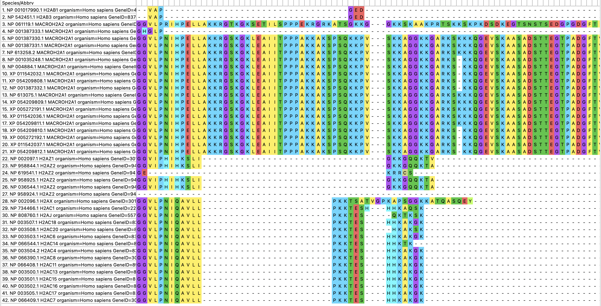
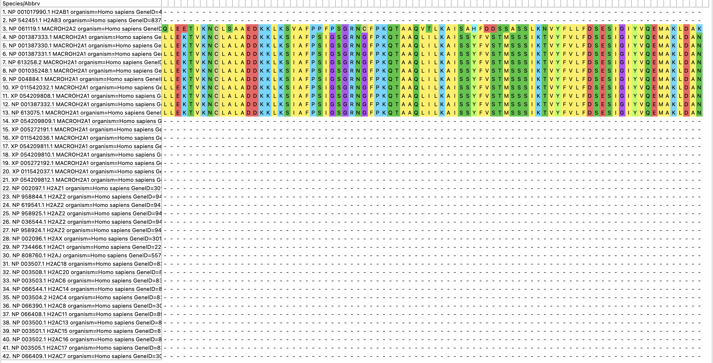
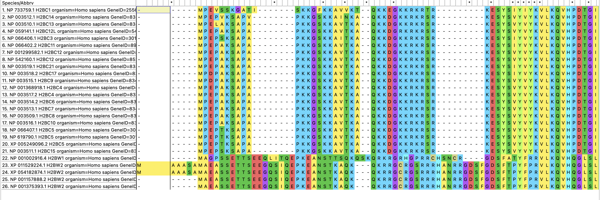
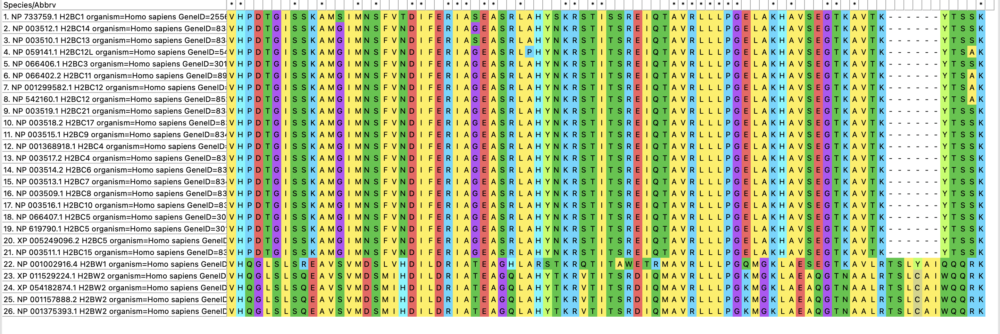
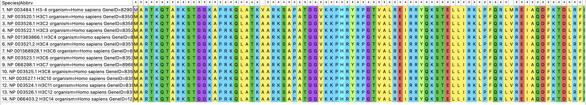
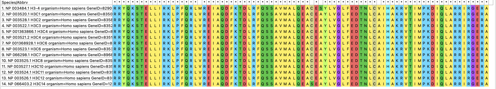
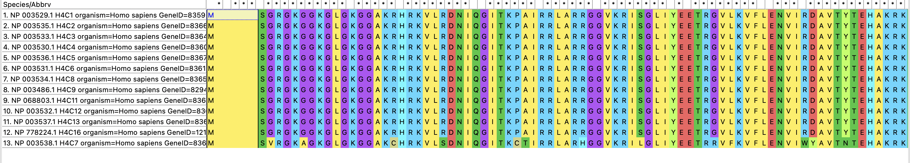
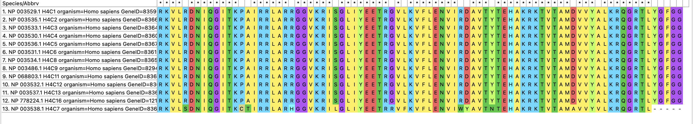
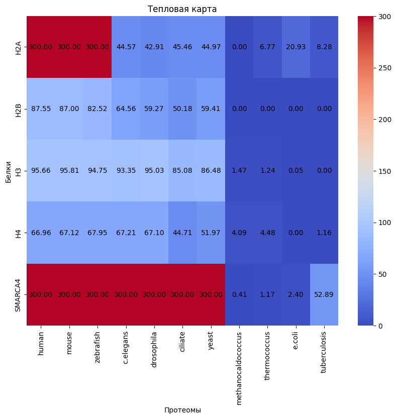
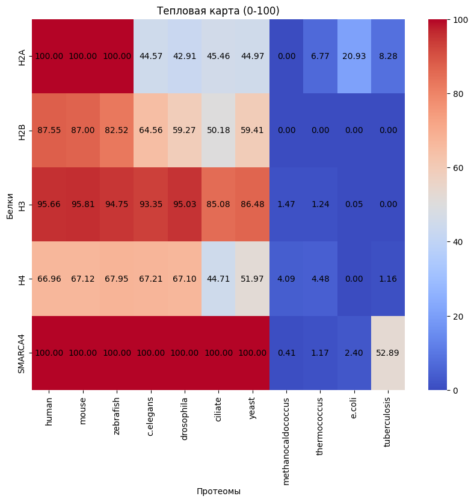

# hse23_project
## Структура проекта:

В папке raw_data лежат: мой белок SCARCA4, а также выровненные гистоны с помощью Muscle, в histones_muscle_full лежат все аминокислотные последовательности, а в histones_muscle по одной выбранные мной для каждого гистона.

В папке data лежат уже результаты работы команд: для каждого гистона и моего белка по папкам разбиты все файлы blast, а также итоговая таблица со значениями E-Value.

В папке scripts лежат все скрипты, которые я писала в терминале: add_index_proteomes - добавляет индексацию к базам, my_protein_blast - применяет команду blastp ко всем протеомам с моим белком, all_histones_blast - применяет команду blastp ко всем протеомам со всеми гистонами. 

В папке images все изображения с результатами. 

В основном все было сделано через терминал, но итоговая таблица обрабатывалась через питон, ссылка на коллаб: https://colab.research.google.com/drive/16n7WPc6iSDeBNSR8ayQMyQwv4EQLz_4T?usp=sharing. 

## Выбранные данные для проекта:
| SMARCA4| H2A | H2B | H3 | H4 |
|-----------|-----|-----|----|----|
|    ENST00000643549.1   | NP_613258.2 MACROH2A1    |   NP_066402.2 H2BC11  |  NP_003520.1 H3C1  |   NP_003529.1 H4C1 |

- В статьях описывается взаимосвязь SMARCA4 c H3K27ac: в [1] говорится, что мутации SMARCA4 вызывают понижение уровня H3K27ac,  во [2] говорится, что SMARCA4 выступает в качестве главного регулятора некоторых положительных промоторов H3K27ac.
- Входит в состав SWI/SNF комплексов, которые являются одними из наиболее известных комплексов ремоделирования хроматина.
- Экспрессируется практически во всех тканях человека: больше всего в яичках и мозге, меньше всего в поджелудочная железе и печени.
- Обладает сложной доменной структурой: Bromo_SNF2L2, HSA, PLN03142, Smc, Med15, DEXHc_SMARCA4, BRK, QLQ, SnAC.
- Cвязан с регуляцией генной экспрессии и эпигенетическим контролем клеточных процессов. 
- SMARCA4 - наиболее часто мутировавший хроматин, ремоделирующий АТФазу при раке. Наличие функционального BRG1 важно для развития после стадии предварительной имплантации. Также имеет решающее значение для развития сперматозоидов. 
- длина выбранной изоформы ENST00000643549.1 = 1649.

[1] Hodges, H. C., Stanton, B. Z., Cermakova, K., Chang, C.-Y., Miller, E. L., Kirkland, J. G., … Crabtree, G. R. (2017). Dominant-negative SMARCA4 mutants alter the accessibility landscape of tissue-unrestricted enhancers. Nature Structural & Molecular Biology, 25(1), 61–72.
[2] Sobczak, Pitt, Spickett, & Robaszkiewicz. (2019). PARP1 Co-Regulates EP300–BRG1-Dependent Transcription of Genes Involved in Breast Cancer Cell Proliferation and DNA Repair. Cancers, 11(10), 1539.

# Анализ выравниваний гистонов
Я постаралась сфоткать все выравнивания, но H2A был слишком длинным, поэтому у него сфоткала начало, конец и середину.
### H2A
Анализ: имеет больше всего изоформ. Можно заметить, что их можно поделить на группы по похожести. Нижние (28-42) имеют сильно больше гэпов, но между собой почти не отличаются, как и верхне-средние (5-21) между собой почти не отличаются. Остальные же имеют сильные отличия от этих двух больших групп. 

Вывод: изоформы гистона H2A не являются простыми копиями друг друга, а скорее представляют варианты, которые могут выполнять различные функции в клетке. Различия между изоформами могут быть обусловлены альтернативным сплайсированием, альтернативным началом или окончанием транскрипта, посттранскрипционными модификациями или другими механизмами регуляции экспрессии генов.

### H2B
Анализ: здесь также можно выделить две группы: до 21 и после, внутри группы они максимально похожи. 

Вывод: изоформы гистона H2B также не являются простыми копиями друг друга, а скорее представляют варианты, которые могут выполнять различные функции в клетке.

### H3
Анализ: все аминокислотные последовательности почти что идентичны. 

Вывод: в целом, наблюдаемая высокая схожесть аминокислотных последовательностей гистона H3 подчеркивает его важность и консервативность в клеточных процессах, связанных с упаковкой и регуляцией хроматина. Высокая схожесть может указывать на то, что гены H3 произошли от общего предка и подвергались консервативной эволюции. 

### H4
Анализ: все аминокислотные последовательности почти что идентичны. 

Вывод: в целом, наблюдаемая высокая схожесть аминокислотных последовательностей гистона H4 подчеркивает его важность и консервативность в клеточных процессах, связанных с упаковкой и регуляцией хроматина.

# Анализ blast файлов и тепловая карта
Начальная таблица:

|       | human    | mouse    | zebrafish    | c.elegans    | drosophila    | ciliate    | yeast    | methanocaldococcus    | thermococcus    | e.coli    | tuberculosis    |
|-------|----------|----------|--------------|--------------|---------------|------------|----------|-----------------------|-----------------|-----------|-----------------|
| H2A   | 0.0      | 0.0      | 0.0          | 2.71e-45     | 1.23e-43      | 3.44e-46   | 1.07e-45 | 1.2                   | 1.71e-07        | 1.18e-21  | 5.29e-09        |
| H2B   | 2.81e-88 | 1.01e-87 | 3.05e-83     | 2.78e-65     | 5.43e-60      | 6.56e-51   | 3.85e-60 | 1.7                   | 1.2             | 1.6       | 1.7             |
| H3    | 2.19e-96 | 1.54e-96 | 1.77e-95     | 4.46e-94     | 9.39e-96      | 8.41e-86   | 3.31e-87 | 0.034                 | 0.057           | 0.90      | 4.6             |
| H4    | 1.09e-67 | 7.60e-68 | 1.13e-68     | 6.15e-68     | 8.02e-68      | 1.96e-45   | 1.08e-52 | 8.22e-05              | 3.31e-05        | 1.3       | 0.069           |
| SMARCA4 | 0.0      | 0.0      | 0.0          | 0.0          | 0.0           | 0.0        | 0.0      | 0.39                  | 0.067           | 0.004     | 1.29e-53        |

Логарифмированная таблица:

|            | human  | mouse  | zebrafish | c.elegans | drosophila | ciliate | yeast  | methanocaldococcus | thermococcus | e.coli | tuberculosis |
|------------|--------|--------|-----------|-----------|------------|---------|--------|---------------------|--------------|--------|--------------|
| H2A        | 300.00 | 300.00 | 300.00    | 44.57     | 42.91      | 45.46   | 44.97  | 0.00                | 6.77         | 20.93  | 8.28         |
| H2B        | 87.55  | 86.99  | 82.52     | 64.56     | 59.27      | 50.18   | 59.41  | 0.00                | 0.00         | 0.00   | 0.00         |
| H3         | 95.66  | 95.81  | 94.75     | 93.35     | 95.03      | 85.08   | 86.48  | 1.47                | 1.24         | 0.05   | 0.00         |
| H4         | 66.96  | 67.12  | 67.95     | 67.21     | 67.10      | 44.71   | 51.97  | 4.08                | 4.48         | 0.00   | 1.16         |
| SMARCA4    | 300.00 | 300.00 | 300.00    | 300.00    | 300.00     | 300.00  | 300.00 | 0.41                | 1.17         | 2.40   | 52.89        |

Меньшие значения e-value указывают на более значимое сходство между белками и более высокую степень вероятности, что такое сходство является значимым. Белки H2A и SMARCA4 имеют минимальное значение e-value 0.0 для всех организмов, что указывает на высокую степень сходства между этими белками у всех исследуемых организмов. Белки H2B и H3 также показывают низкие значения e-value для большинства организмов.

В результате работы была получена следующая тепловая карта:

Стоит отметить, что значение 300 было введено искуственно, так как нужно было заменить 0 на какое-то очень маленькое число, если в данном случае брать $10^{-100}$, то тепловая карта будет более усредненной (так как сейчас 300 далек от реального максимума ~96). В лекции просили заменять 0 на $10^{-100}$, но для себя я также сделала карту с $10^{-100}$:

Как и было предположено на лекции, можно заметить, что все белки имеют хорошие попадания в большенстве организмов, за исключением архей и бактерий. Также видим, что максимальное попадание имеет H2A с многоклеточными позвоночными, а также мой белок SMARCA4 с многоклеточными позвоночными, многоклеточными беспозвоночными и одноклеточными эукартиотами. Также интересно, что H3, с модификацией которого исследовался мой белок, имеет почти максимальные значения у тех же организмов, что и SMARCA4 и в целом максимально приближен по распределению значений к нему. Исходя из вышеперечисленных данных, можно предположить, что белок SMARCA4 появился в очень ранних стадиях эволюции. Его существование можно проследить в большенстве организмах. 

# Анализ гомологов
Наиболее далеким от человека и подходящим под условия гомологом в моем случае оказался yeast (у tuberculosis длина белка отличается на 600 от моего). Через blast файл узнаем, что белок-гомолог, дающий такой e-value, это NP_014933.3. Далее всю информацию о нем я смотрела на сайте Uniprot.
- Ген - SNF2, идентификатор белка-гомолога - NP_014933.3.
- Имеет длину = 1703.
- Имеет набор доменов: QLQ, HSA, Helicase ATP-binding, Helicase C-terminal, Bromo.
- Функция: Участвует в активации транскрипции. Каталитический компонент комплекса SWI/ SNF, АТФ-зависимый хроматин-ремоделирующего комплекса, который необходим для положительной и отрицательной регуляции экспрессии генов большого количества генов. Он изменяет структуру хроматина, изменяя контакты ДНК-гистона в нуклеосоме, что в конечном итоге приводит к изменению положения нуклеосомы, тем самым облегчая или подавляя связывание генно-специфических факторов транскрипции.
- Модификация H3K27ac дейсвительно присутсвует у yeast. [3]
- Также была установлена информацию о том, функция найденного далекого белков-ортологов связана с выбранной эпигенетической метков. Cубъединица Yaf9 SWR1-c (SWi2/snf2-Related 1) нацеливается на гистон H3K27ac через свой домен YEATS у дрожжей.[4]

[3] Tie, F.; Banerjee, R.; Stratton, C. A.; Prasad-Sinha, J.; Stepanik, V.; Zlobin, A.; Diaz, M. O.; Scacheri, P. C.; Harte, P. J. (2009). CBP-mediated acetylation of histone H3 lysine 27 antagonizes Drosophila Polycomb silencing. Development, 136(18), 3131–3141. doi:10.1242/dev.037127 

[4] Wang, Jianhao; Gao, Sujuan; Peng, Xiuling; Wu, Keqiang; Yang, Songguang (2019). Roles of the INO80 and SWR1 Chromatin Remodeling Complexes in Plants. International Journal of Molecular Sciences, 20(18), 4591–. doi:10.3390/ijms20184591 
